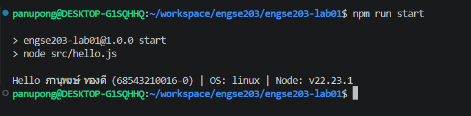

# Week 01 Evidence

## 1. Environment Versions

---

## 2. Screenshot Programs

---

## 3. Repository Info
- **Original Repository URL:** https://github.com/PanupongThongdee/engse203-lab01--68543210016-0.git
- **Commit SHA:** 7e52641

---

## 4. Reflection
ใน Lab นี้ใช้ Git workflow โดยเริ่มจากการ clone repository มาที่เครื่อง local จากนั้นสร้าง branch หรือ commit บันทึกการเปลี่ยนแปลงข้อมูลนักศึกษาและรันการ setup สคริปต์ แล้วจึง push โค้ดกลับไปยัง GitHub main branch เพื่อทำการสร้าง GitHub Pages อัตโนมัติ
