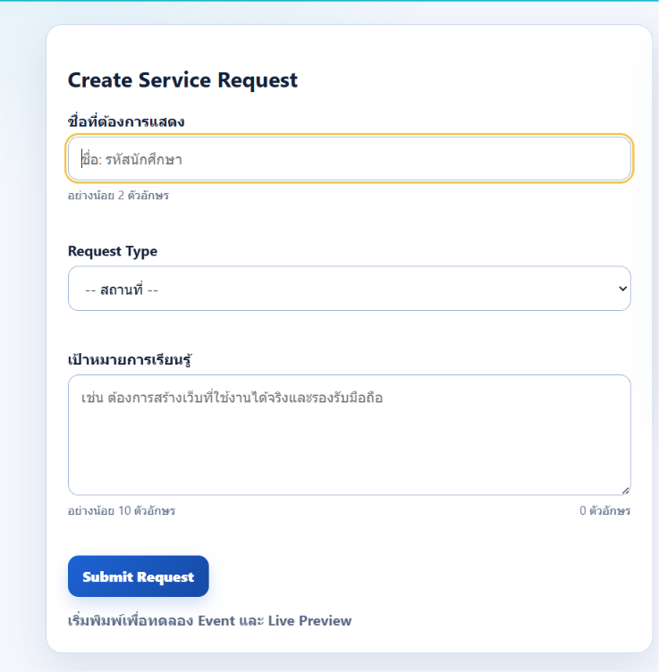
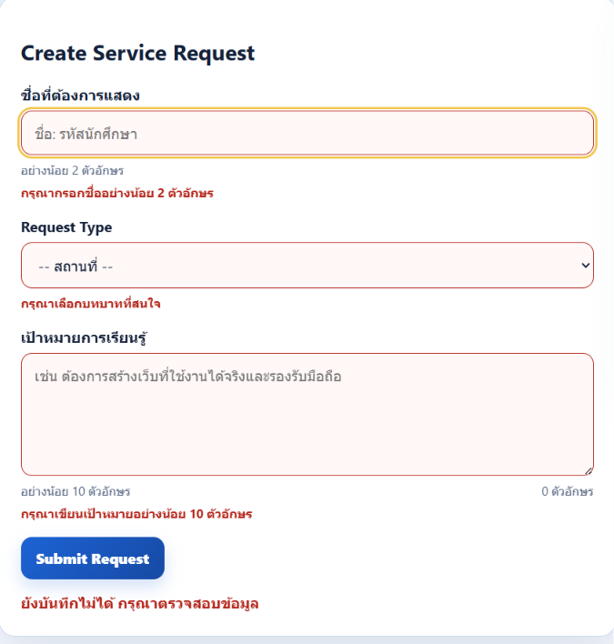
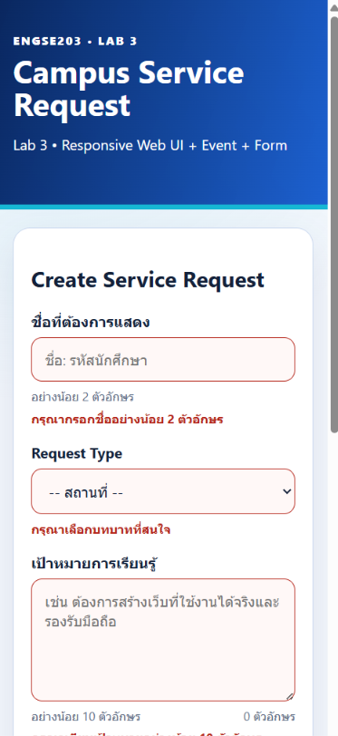
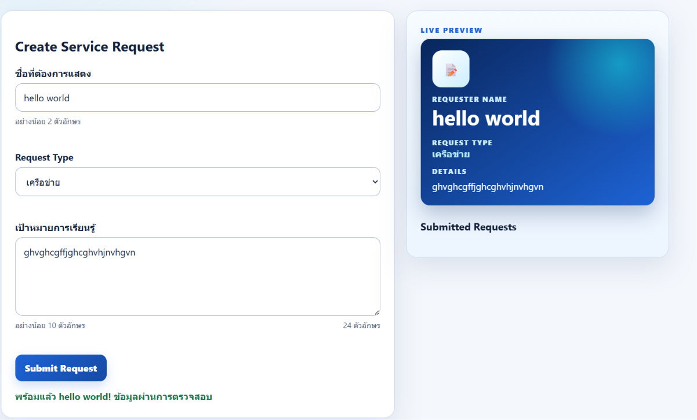
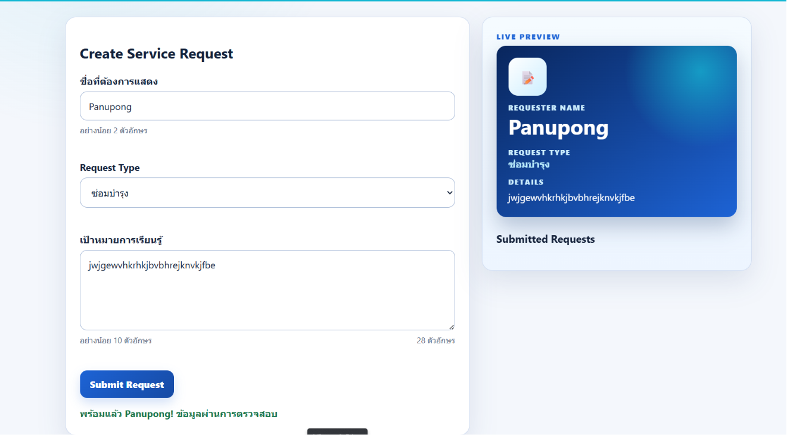
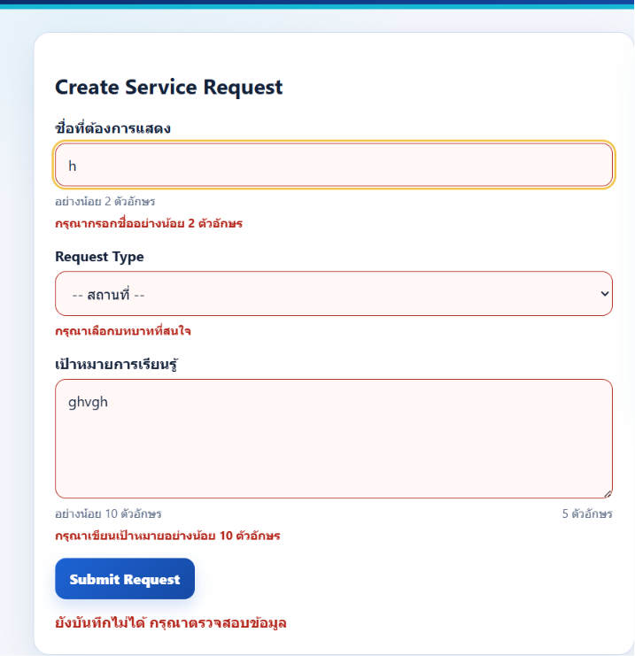

# ENGSE203 LAB 03 — Responsive Web UI, Event and Form

## 👥 ผู้จัดทำ
* **Student ID:** 68543210016
* **Name:** นาย ภานุพงษ์ ทองดี
* **Operating System:** WSL + Windows
* **GitHub Pages URL:** [https://panupongthongdee.github.io/engse203-lab03-68543210016/](https://panupongthongdee.github.io/engse203-lab03-68543210016/)

---

## 🎯 วัตถุประสงค์ของงาน
* เพื่อศึกษาและใช้งาน **Semantic HTML** และหลักการ **Accessibility (a11y)** ในการพัฒนาเว็บฟอร์ม
* เพื่อพัฒนาและออกแบบ **Responsive Layout** ที่รองรับการแสดงผลบนหน้าจอขนาดต่าง ๆ (รวมถึงขนาด 375px และการ Zoom 200%) โดยไม่มี Web UI Breakdown หรือ Horizontal Scroll
* เพื่อเรียนรู้การจัดการสเตตัสและเหตุการณ์บนเว็บเพจผ่าน **Event Listener** (`input`, `submit`) และการจัดการ DOM Manipulation แบบปลอดภัยด้วย `textContent`
* เพื่อฝึกฝนกระบวนการทำงานร่วมกันโดยใช้ **Gitflow Workflow** (Feature Branch และ Merge Checkpoints) พร้อมทั้งฝึกใช้งาน GitHub Pages

---

## 🛠️ เครื่องมือที่ใช้
* **Editor:** Visual Studio Code
* **Environment:** WSL (Windows Subsystem for Linux - Ubuntu)
* **Build Tool:** Vite
* **Version Control:** Git & GitHub

---

## 🚀 วิธีติดตั้งและรัน

```bash
# ติดตั้ง dependencies ทั้งหมด
npm install

# รันโปรเจกต์ในโหมด Development
npm run dev

# บิลด์โปรเจกต์เพื่อเตรียม Deploy
npm run build


.
├── docs/
├── node_modules/
├── public/
├── src/
│   ├── main.js
│   └── style.css
├── .gitignore
├── index.html
├── package-lock.json
├── package.json
├── README.md
└── vite.config.js


Semantic HTML / Accessibility: มีการใช้แท็กโครงสร้างพื้นฐานครบถ้วน (<header>, <main>, <section>, <aside>, <form>) และมีการผูก aria-describedby เพื่อเชื่อมโยงช่องกรอกข้อมูลกับข้อความช่วยเหลือ/ข้อความแจ้งเตือนความผิดพลาด

Event & Live Preview: ระบบแสดงผลลัพธ์การพิมพ์แบบทันที (Live Preview) รวมถึงมีฟังก์ชัน Live Counter นับจำนวนตัวอักษรในกล่อง Details แบบเรียลไทม์ และระบบเมื่อกด Submit จะส่งข้อมูลลงรายการด้านล่างพร้อมเคลียร์ฟอร์มโดยไม่รีเฟรชหน้าเว็บด้วย preventDefault()

Responsive Layout: หน้าเว็บสามารถปรับสัดส่วนการแสดงผลจาก 2 คอลัมน์บน Desktop ลงมาเหลือ 1 คอลัมน์บน Mobile (375px) ได้อย่างสมบูรณ์ และรองรับการขยายหน้าจอแบบ Zoom 200% ได้โดยไม่เกิดแถบเลื่อนแนวนอน (Horizontal Scroll)

GitHub Pages URL: https://panupongthongdee.github.io/engse203-lab03-68543210016/


ภาพหน้าจอ (Screenshots)
### 1. หน้าจอปกติ ไม่มี error


### 2. หน้าจอปกติ เมื่อมี error


### 3. มุมมอง (375px)


### 4. Live Preview
 <!-- ⚠️ ตรวจสอบ/เปลี่ยนชื่อไฟล์รูปภาพให้ตรงกับที่คุณบันทึกจริง -->

### 5. Success State
 <!-- ⚠️ ตรวจสอบ/เปลี่ยนชื่อไฟล์รูปภาพให้ตรงกับที่คุณบันทึกจริง -->

### 6. Validation Error
 <!-- ⚠️ ตรวจสอบ/เปลี่ยนชื่อไฟล์รูปภาพให้ตรงกับที่คุณบันทึกจริง -->


🧩 ปัญหาที่พบและวิธีแก้ไข
ปัญหาที่ 1: โครงสร้างโฟลเดอร์ซ้อนและการกำหนด Base Path สำหรับ GitHub Pages ไม่ถูกต้อง
สาเหตุ: ในตอนแรก โครงสร้างไฟล์และโฟลเดอร์หลักของโปรเจกต์ (เช่น src, index.html, package.json) ถูกสร้างซ้อนอยู่ภายในโฟลเดอร์ย่อย my-vanilla-app อีกชั้นหนึ่ง ส่งผลให้เมื่อสั่งรัน npm run build ระบบไม่สามารถตรวจพบคำสั่งบิวด์ที่ชั้นนอกสุด (เกิดข้อผิดพลาด npm error code ENOENT) และเมื่อนำไป Deploy บน GitHub Pages ตัวเว็บพยายามจะวิ่งไปหาไฟล์ Assets ที่เส้นทาง /my-vanilla-app/assets/ ซึ่งไม่มีอยู่จริง ทำให้เกิดข้อผิดพลาด 404 (Not Found) และหน้าเว็บแสดงผลเป็นหน้าขาวว่างเปล่า

วิธีแก้ไข:

จัดระเบียบโครงสร้างโปรเจกต์ใหม่ โดยย้ายไฟล์และโฟลเดอร์ทั้งหมดออกมาอยู่ที่ชั้นนอกสุด (Root) ของ Repository และทำการลบโฟลเดอร์ my-vanilla-app ที่ว่างเปล่าทิ้งไป

แก้ไขไฟล์ index.html หลักให้ชี้เส้นทางสคริปต์ต้นฉบับไปที่ ./src/main.js แทนการชี้ไปยังโฟลเดอร์ assets เวอร์ชันบิวด์เก่า

ปรับปรุงการตั้งค่าในไฟล์ vite.config.js โดยเปลี่ยนค่า base ให้เป็นแบบ Relative Path (./) เพื่อบังคับให้ Vite ลิงก์เส้นทางไฟล์ระบบตอนใช้งานจริง (Production) ได้อย่างถูกต้องไม่ว่าจะอยู่บน URL ใด

รันคำสั่ง npm install และ npm run build ใหม่ที่ชั้นนอกสุด เพื่อให้สร้างโฟลเดอร์ docs/ เวอร์ชันล่าสุดที่แก้ไข Path แล้ว ก่อนจะ Push อัปเดตขึ้น GitHub

ปัญหาที่ 2: ข้อความล้นกรอบแสดงผลพรีวิว (Overflow Breakdown)
สาเหตุ: เมื่อพิมพ์ข้อความภาษาอังกฤษหรืออักขระยาวติดต่อกันเป็นพรืดโดยไม่มีการเว้นวรรคในฟอร์ม ข้อความจะปลิ้นทะลุกรอบ (Overflow Breakdown) ออกมานอกพื้นที่ Live Preview

วิธีแก้ไข: เพิ่มคำสั่ง overflow-wrap: break-word; และ word-break: break-all; ให้กับแท็กแสดงผลพรีวิวในไฟล์ CSS เพื่อบังคับให้ข้อความตัดคำขึ้นบรรทัดใหม่ทันทีเมื่อชนขอบขวาของเฟรม

📚 References & AI Assistance
🤖 AI Tools Utilized
Tools: Gemini

Purpose: ศึกษาแนวทางการจัดการ DOM Events (input และ submit) และกระบวนการตรวจสอบข้อมูล (Form Validation) รวมถึงการประยุกต์ใช้ HTML attributes เช่น id, name และ aria-describedby เพื่อควบคุมออบเจ็กต์ผ่าน querySelector

✍️ My Adaptations & Contributions
Logic Implementation: ทำความเข้าใจและเขียนโครงสร้าง main.js และ index.html ด้วยตนเอง โดยเน้นลำดับการทำงานของฟังก์ชัน การส่งค่าระหว่างฟังก์ชัน และการเข้าถึง DOM Elements

Responsive CSS (Mobile-First): ออกแบบเลย์เอาต์ด้วยตนเองทั้งหมด โดยใช้ @media query ปรับโครงสร้างคลาส .page-grid ให้แสดงผลเป็น 2 คอลัมน์บนหน้าจอขนาด Desktop

AI Assistance: ใช้ AI เป็นที่ปรึกษาในการปรับปรุงดีไซน์และการจัดสัดส่วนหน้าเว็บ (UI/UX) ให้มีความสวยงามยิ่งขึ้น ในขณะที่กลไกการเขียนโค้ดและโครงสร้างเลย์เอาต์หลักทั้งหมด เป็นการพัฒนาและปรับแต่งด้วยตนเอง