# ENGSE203 LAB 4 — Student Evidence README

## ผู้จัดทำ

- ชื่อ–นามสกุล: ภานุพงษ์ ทองดี
- รหัสนักศึกษา: 68543210016-0
- Section: 1

## URLs

- Repository: https://github.com/PanupongThongdee/engse203-student-labs-68543210016-0
- Pull Request: TODO
- GitHub Pages: (https://panupongthongdee.github.io/engse203-student-labs-68543210016-0/labs/week-04/)

## Component Tree

```text

App (State Owner: requests, currentFilter)
├── AppHeader (Stateless)
├── SummaryPanel (Stateless - receives requests)
├── RequestForm (State Owner: formData, errors, feedback)
├── FilterBar (Stateless - receives currentFilter, onFilterChange)
└── RequestList (Stateless - receives requests, onDeleteRequest)
    └── RequestCard (Stateless - receives request, onDeleteRequest)
```

## Setup และ Run

```bash
nvm use
npm install
npm run dev
npm run check
npm run build
npm run preview
```

## State / Props / Callback Explanation


### 1. State Ownership (ผู้ครอบครอง State)
* **`App` Component:** ครอบครอง `requests` (รายการคำร้องทั้งหมด) และ `currentFilter` (สถานะการกรองที่เลือก) เนื่องจากเป็นข้อมูลศูนย์กลางที่ต้องแชร์ให้หลาย Component ใช้ร่วมกัน (Lifting State Up)
* **`RequestForm` Component:** ครอบครอง Local State ได้แก่ `formData`, `errors` และ `feedback` เนื่องจากเป็นข้อมูลชั่วคราวที่ใช้ประมวลผลและแสดงผลเฉพาะภายในฟอร์มเท่านั้น

### 2. Props Down (การส่งข้อมูลลงล่าง)
* **`App` → `SummaryPanel`:** ส่ง `requests` ลงไปเพื่อคำนวณสรุปจำนวนคำร้องแยกตามสถานะ
* **`App` → `FilterBar`:** ส่ง `currentFilter` ลงไปเพื่อแสดงผลว่าผู้ใช้กำลังเลือกกรองสถานะใดอยู่
* **`App` → `RequestList`:** ส่ง `requests` (รายการที่ผ่านการกรองแล้ว) ลงไปวนลูปแสดงผล
* **`RequestList` → `RequestCard`:** ส่ง `request` (ข้อมูลคำร้อง 1 รายการ) ลงไปแสดงผลในแต่ละการ์ด

### 3. Callbacks Up (การส่ง Event ย้อนกลับขึ้นบน)
* **`RequestForm` → `App` (`onAddRequest`):** ส่ง Object คำร้องใหม่ขึ้นไปให้ `App` อัปเดตเพิ่มเข้า State `requests` แบบ Immutable
* **`FilterBar` → `App` (`onFilterChange`):** ส่งค่าสถานะที่เลือกใหม่ขึ้นไปอัปเดต State `currentFilter` ของ `App`
* **`RequestCard` → `RequestList` → `App` (`onDeleteRequest`):** ส่ง `id` ของคำร้องที่ถูกกดลบย้อนกลับขึ้นไปเพื่อให้ `App` ลบรายการนั้นออกจาก State `requests`

## Test Evidence

| Test ID | Actual Result | Pass/Fail | Evidence/Screenshot |
|---|---|---|---|
| TC-01 Initial | แอปพลิเคชันโหลดและแสดงผล Component หลักครบถ้วนพร้อมข้อมูลเริ่มต้น | Pass | 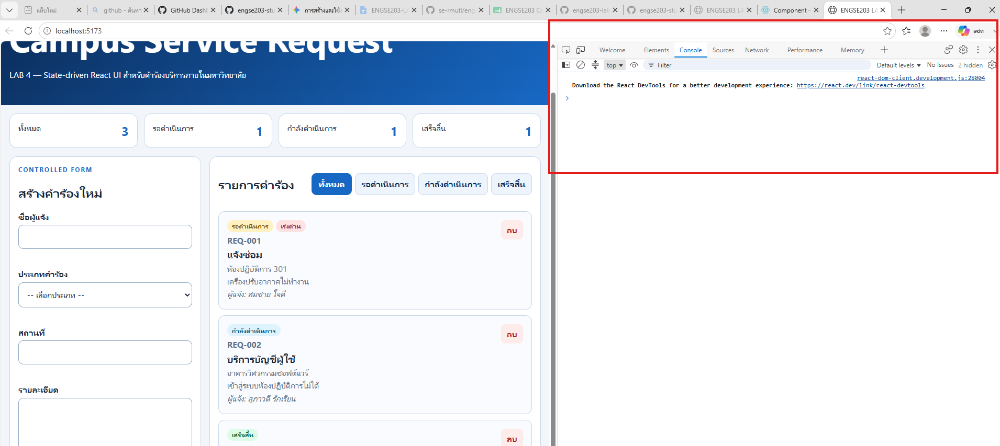 |
| TC-02 Controlled input | Input ทุกตัวในฟอร์มตอบสนองการพิมพ์และการเลือกค่าตาม State ได้อย่างถูกต้อง | Pass | 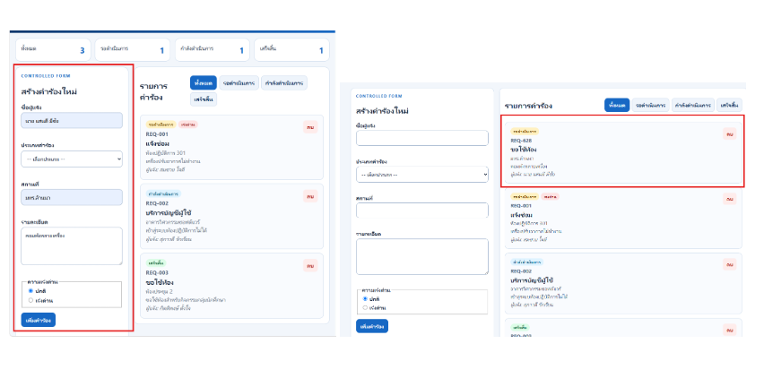 |
| TC-03 Invalid | แสดงข้อความ Error ใต้ Field เมื่อข้อมูลไม่ครบ และระงับการ Submit | Pass | 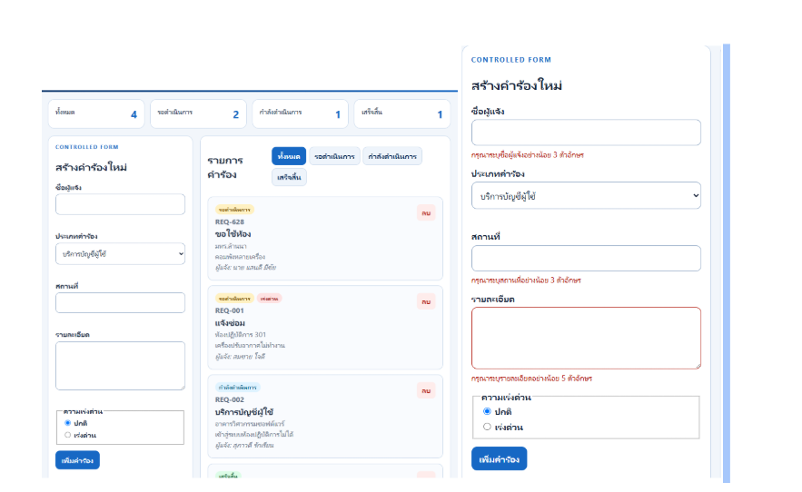 |
| TC-04 Valid add | เพิ่มคำร้องใหม่สำเร็จ รายการขึ้นบนสุดพร้อมสถานะ pending และล้างฟอร์มเรียบร้อย | Pass | 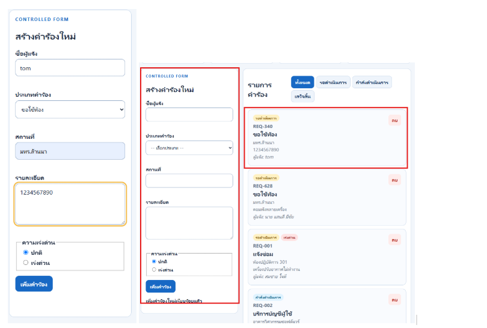 |
| TC-05 Filter | การ์ดคำร้องแสดงผลตรงตามสถานะที่เลือกกรอง เช่น pending, in-progress | Pass | 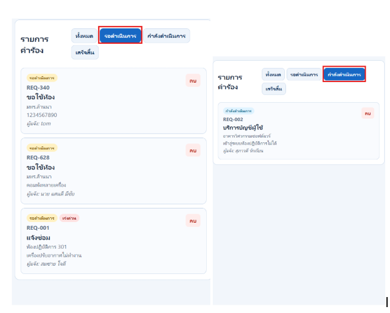 |
| TC-06 All | เมื่อเลือกตัวกรองทั้งหมด ระบบแสดงคำร้องทุกสถานะได้อย่างถูกต้อง | Pass | 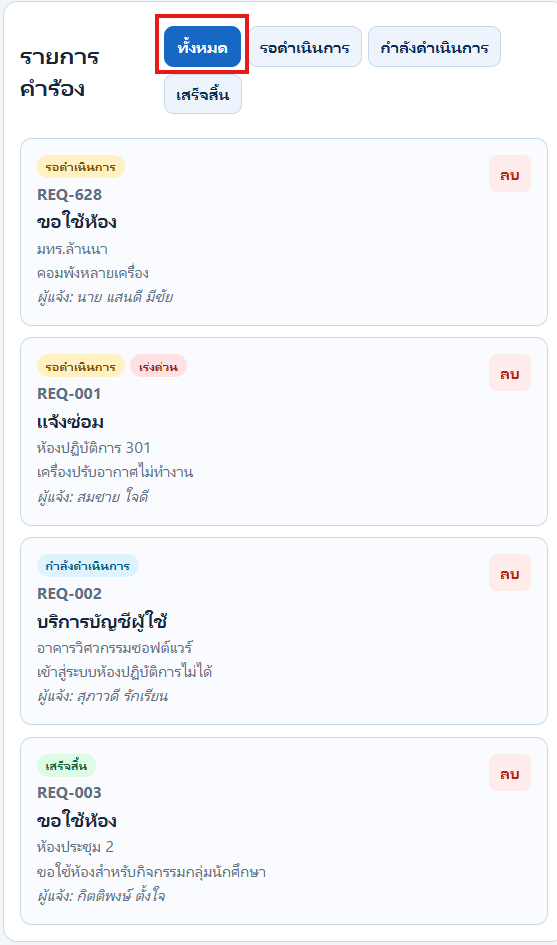 |
| TC-07 Empty | เมื่อไม่มีรายการตามตัวกรอง ระบบแสดงข้อความ Empty State อย่างถูกต้อง | Pass | 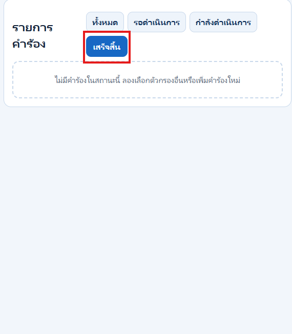 |
| TC-08 Delete | สามารถลบคำร้องได้ถูกต้องตาม ID และรายการรวมถึง Summary อัปเดตถูกต้อง | Pass | 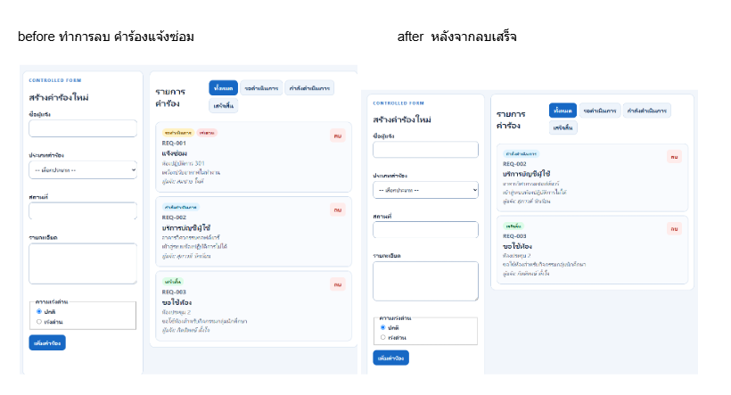 |
| TC-09 Mobile | หน้าเว็บแสดงผลที่ความกว้าง 375px ได้โดยไม่มี Horizontal Scroll | Pass | 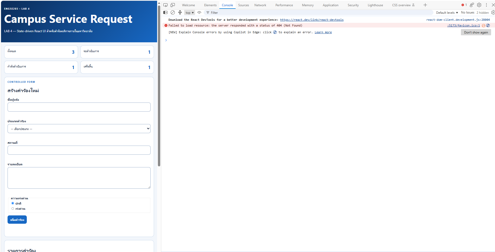 |
| TC-10 Keyboard | สามารถใช้ Keyboard ผ่าน Tab และ Enter ได้ พร้อมแสดง Focus, Error และ Feedback | Pass | 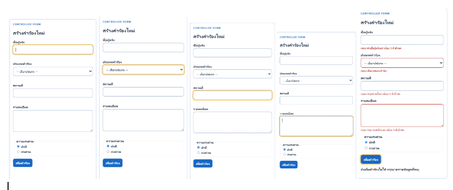 |
| TC-11 Build | สามารถรัน npm run build และเปิด Preview ได้สำเร็จโดยไม่มี Build Error | Pass | 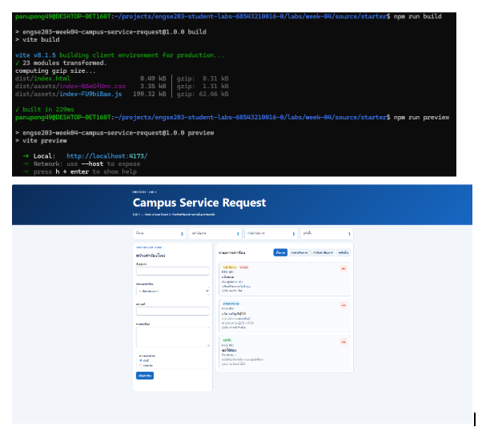 |
| TC-12 Pages | เปิดหน้าเว็บผ่าน Incognito และโหลดหน้าเว็บรวมถึง Assets ได้ครบถ้วน | Pass | 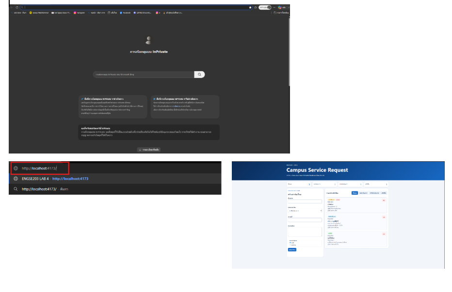 |
## Screenshots

- Desktop:  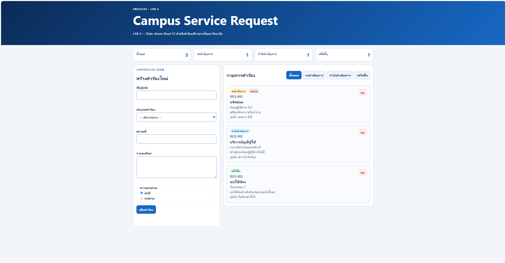
- Mobile 375px: 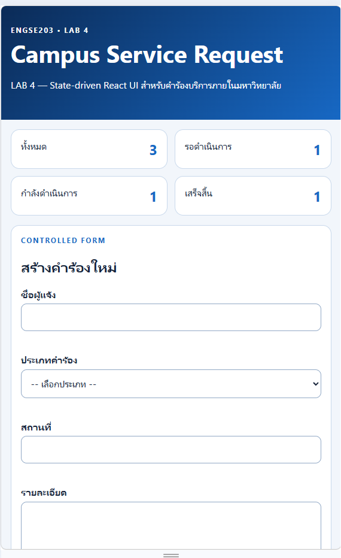
- Validation/empty state: 

## Week 03 → Week 04 Reflection


ใน Week 03 การใช้ Vanilla JS จะเน้นการจัดการแบบ Direct DOM Mutation ซึ่งต้องเขียนโค้ดสั่งการโดยตรง (Imperative) เช่น `appendChild` หรือ `innerHTML` เพื่อปรับเปลี่ยน UI เมื่อข้อมูลเปลี่ยนแปลง ในขณะที่ Week 04 การใช้ React ปรับเปลี่ยนแนวคิดมาเป็น State-driven UI แบบ Declarative โดย UI จะถูก render ใหม่โดยอัตโนมัติตามสถานะของ State ($UI = f(State)$) การเปลี่ยนมาใช้ State-driven UI ช่วยลดความซับซ้อนในการจัดการ DOM ด้วยตนเอง ป้องกันปัญหาข้อมูลบนหน้าจอไม่ตรงกับสถานะจริง (Out-of-sync) และช่วยให้โค้ดมีโครงสร้างที่เป็นระเบียบ บำรุงรักษาได้ง่ายขึ้นมาก

## AI / External Resource Disclosure

- **เครื่องมือ / แหล่งข้อมูลที่ใช้:** Gemini AI Assistant
- **Prompt / คำถามสำคัญที่ใช้:**
  - "ตรวจโค้ด RequestForm.jsx และ RequestCard.jsx ให้ตรงตาม Spec ของ LAB 4"
  - "วิธีแก้ปัญหา ID ยาวเกินไป และการทำ ID แบบ 4 หลัก / Running Number ใน React"
  - "โครงสร้างการเขียน Component Tree และอธิบาย State Ownership / Data Flow สำหรับ README.md"
- **ส่วนที่นำมาปรับใช้:**
  - นำโครงสร้าง Controlled Form (`formData`) และ Validation logic ไปปรับแก้ใน `src/components/RequestForm.jsx`
  - ปรับแก้ลอจิกการสร้าง `id` ใน `src/App.jsx` ให้เป็นแบบ Immutable และมีรูปแบบที่ถูกต้อง
  - นำแผนผัง Component Tree และคำอธิบายการไหลของข้อมูล (Props / Callbacks) ไปกรอกใน `README.md`
- **วิธีตรวจสอบความถูกต้อง:**
  - ตรวจสอบผ่าน Verifier Script ของโครงการด้วยคำสั่ง `npm run check`
  - ทดสอบการทำงานจริงบนเว็บเบราว์เซอร์ (`npm run dev`) ทั้งการกรอกฟอร์ม validation, การเพิ่มรายการ, การกรองสถานะ และการกดลบรายการ

