# ENGSE203 LAB 05 — รายงานผลการทดสอบ

**ชื่อ–รหัส:** นาย ภานุพงษ์ ทองดี  68543210016-0
**Branch:** `lab/week-05` · **Commit:** `Push Lab Week05`
**ระบบปฏิบัติการ:** Window (WSL) · **เบราว์เซอร์:** `Google`
**Node version (`node -v`):** v22.23.1
**วันที่ทดสอบ:** 28/8/69

---

## วิธีกรอก — อ่านก่อนเริ่ม

| ช่อง | กรอกอะไร |
|---|---|
| **ผลจริง** | สิ่งที่<strong>เห็นจริง</strong>บนหน้าจอ ไม่ใช่สิ่งที่ควรเห็น |
| **สถานะ** | `PASS` · `FAIL` · `NOT RUN` |
| **หลักฐาน** | ชื่อไฟล์ภาพหรือหมายเหตุเพิ่มเติม |

> **ถ้าทดสอบแล้วไม่ผ่าน ให้เขียน `FAIL` พร้อมสิ่งที่เห็นจริง** อย่าเขียนว่าผ่านทั้งที่ยังไม่ได้ทดสอบ
>
> รายงานที่เขียนย้อนหลังจะเป็น `PASS` ทั้งหมดเสมอ ซึ่งไม่มีคุณค่าอะไรเลย · ในการทำงานจริง รายงานแบบนี้คือสิ่งที่ทำให้คนอื่นเชื่อได้ว่างานของคุณผ่านการตรวจสอบมาแล้ว
>
> **กรอกทีละ checkpoint** อย่ากองไว้ทำทีเดียวตอนท้าย เพราะพอถึงตอนนั้นคุณจะจำไม่ได้แล้วว่าเห็นอะไร

**เงื่อนไขเริ่มต้นของทุกข้อ** — รัน `npm run dev` แล้วเปิด URL ที่แสดง เว้นแต่ระบุเป็นอย่างอื่น

---

## คาบ 5A · CP02 — Routing

| ID | ทำอะไร | ผลที่ควรได้ | ผลจริง | สถานะ | หลักฐาน |
|---|---|---|---|---|---|
| **TC-L5-01** | เปิด `#/` | Dashboard แสดงแผงสรุปและรายการคำร้อง |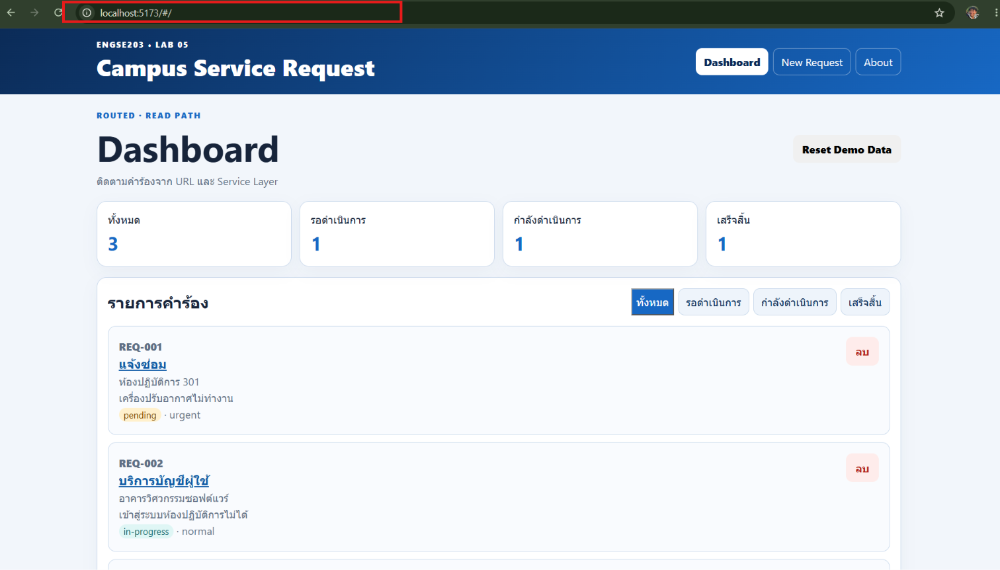 |Pass|`images/show-dashboard.png` |
| **TC-L5-02** | กดเมนู Dashboard → New Request → About ทีละปุ่ม · เปิด DevTools แท็บ Network ค้างไว้ | เปลี่ยนหน้าทั้ง 3 ครั้ง · **ไม่มีไฟล์ `.html` ถูกโหลดใหม่** · ปุ่มที่ active ตรงกับหน้าปัจจุบัน |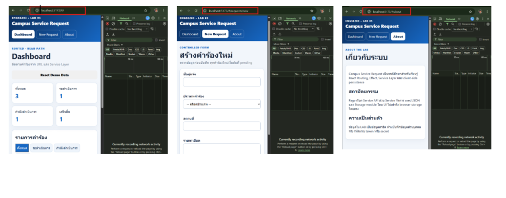 |Pass|`images/Test-DevTools-Network.png`|
| **TC-L5-03** | เปิด `#/requests/new` แล้วกด `F5` | หลัง refresh ยังอยู่หน้า New Request ไม่ใช่หน้า 404 |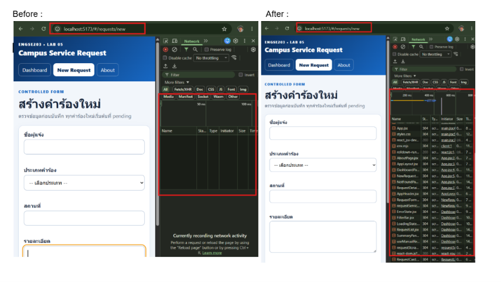|Pass|`images/Test-refresh.png`|
| **TC-L5-06** | เปิด `#/unknown` | หน้า NotFound **พร้อม header และ footer** + ลิงก์กลับ Dashboard |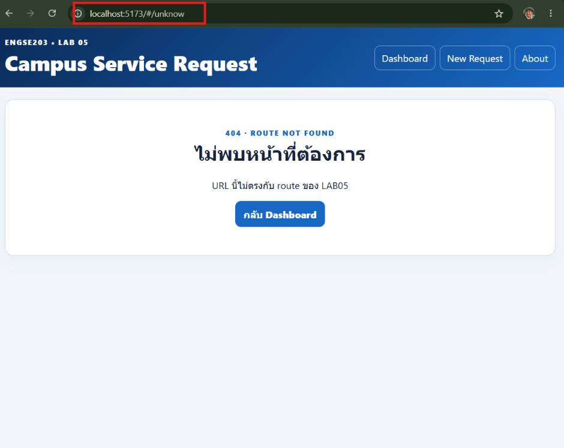|Pass| `images/route-not-found.png` |

---

## คาบ 5A · CP03 — Service และ Data Lifecycle

| ID | ทำอะไร | ผลที่ควรได้ | ผลจริง | สถานะ | หลักฐาน |
|---|---|---|---|---|---|
| **TC-L5-08** | เปิด `#/` แล้วสังเกตช่วงแรก · ถ้าถ่ายไม่ทันให้ตั้ง Network throttle เป็น Slow 3G | เห็นตัวบอกว่ากำลังโหลดก่อน แล้วรายการจึงขึ้น |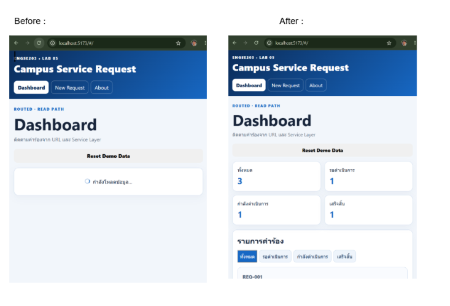|Pass| `images/state-loading.png` |
| **TC-L5-09** | เปิด `#/?scenario=error` | แถบบอกว่าอยู่ในโหมดทดสอบ + ข้อความผิดพลาดที่คนทั่วไปเข้าใจ + ปุ่มลองอีกครั้ง · **ไม่มี stack trace** |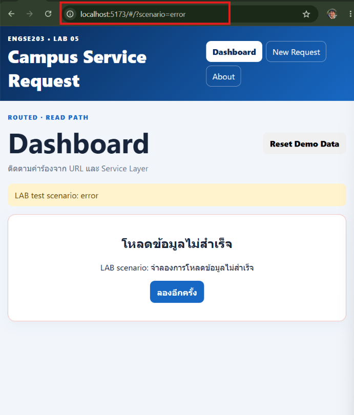|Pass| `images/state-error.png` |
| **TC-L5-10** | จากข้อ 09 กดปุ่มลองอีกครั้ง | **URL เปลี่ยนกลับเป็น `#/`** แล้วโหลดรายการปกติ |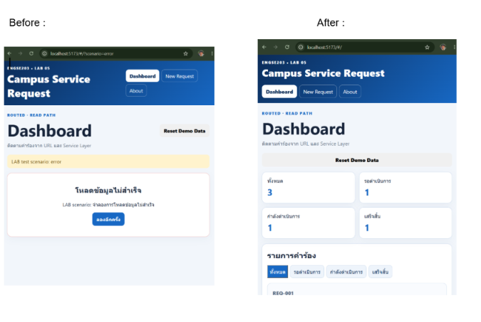|Pass|`images/refresh.png`|
| **TC-L5-11** | เปิด `#/?scenario=empty` | ข้อความว่ายังไม่มีคำร้อง + ปุ่มไปหน้าสร้างใหม่ · **ไม่ใช่หน้าจอ error** |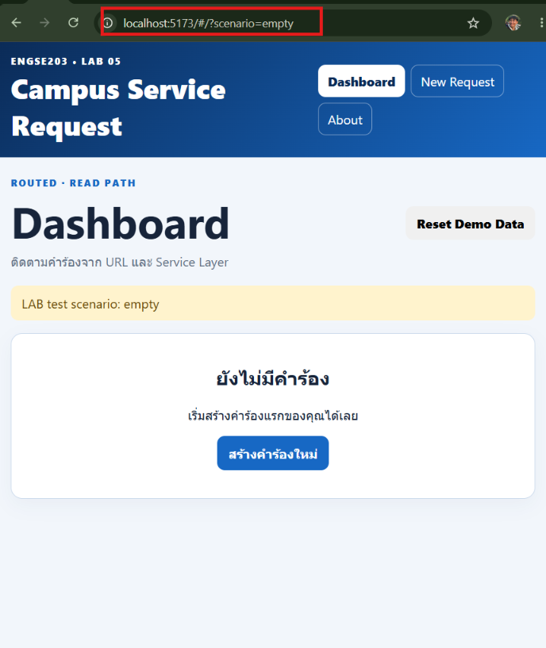| | `images/state-empty.png` |
| **TC-L5-15** | เปลี่ยนตัวกรองครบทุกค่า — all, pending, in-progress, completed | รายการเปลี่ยนถูกต้องทุกค่า · **แผงสรุปไม่เปลี่ยน** เพราะนับจากข้อมูลทั้งหมด |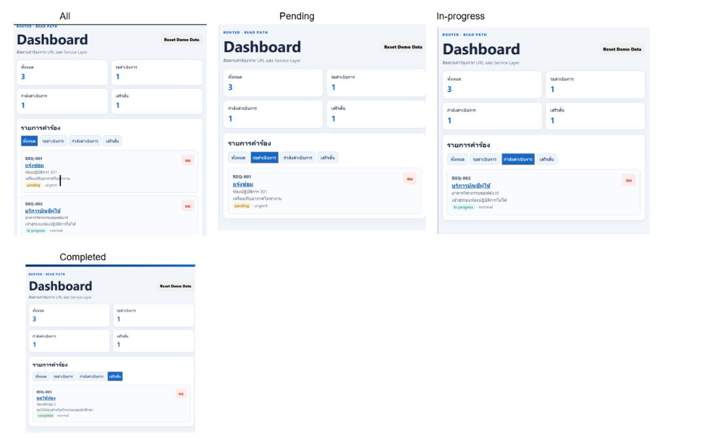|Pass|`images/check-status.png`|

---

## คาบ 5A · CP05a — Dynamic Detail

| ID | ทำอะไร | ผลที่ควรได้ | ผลจริง | สถานะ | หลักฐาน |
|---|---|---|---|---|---|
| **TC-L5-04** | เปิด `#/requests/REQ-001` | แสดงรายละเอียดที่ตรงกับรหัสนั้น |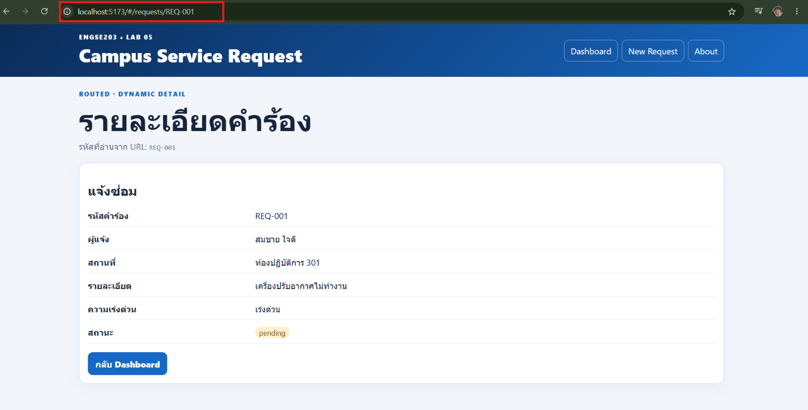|Pass| `images/route-detail-found.png` |
| **TC-L5-05** | เปิด `#/requests/REQ-999` | ข้อความว่าไม่พบคำร้องรหัสนั้น + ลิงก์กลับ · **อยู่ในหน้า Detail ไม่ใช่หน้า NotFound และไม่ใช่หน้าจอ error** |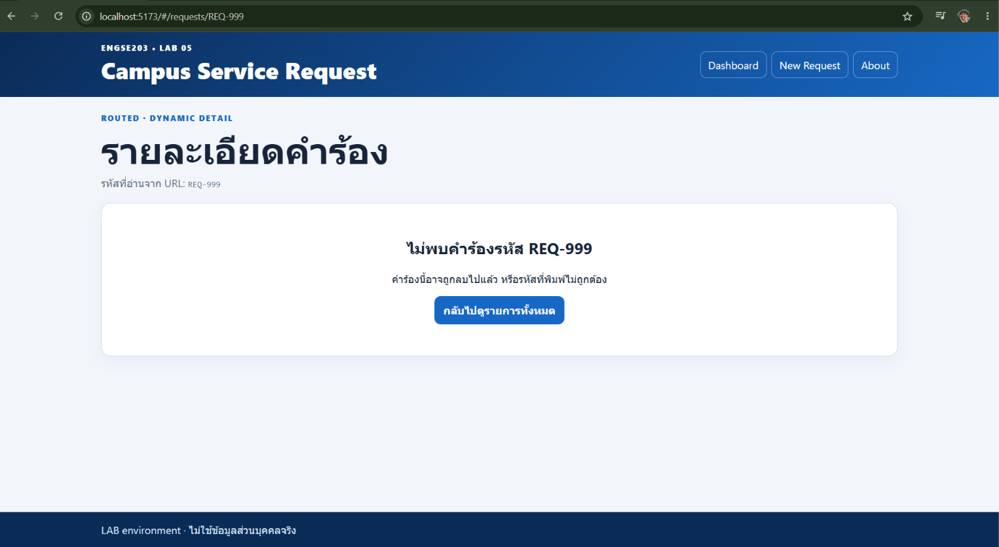|Pass|`images/route-detail-not-found.png`|

---

## คาบ 5B · CP04a — Persistence

| ID | ทำอะไร | ผลที่ควรได้ | ผลจริง | สถานะ | หลักฐาน |
|---|---|---|---|---|---|
| **TC-L5-07** | DevTools → Application → Local Storage → ลบคีย์ `engse203-campus-requests-v1` → refresh | ข้อมูลตัวอย่างกลับมา และคีย์ถูกสร้างใหม่พร้อม envelope · **ไม่มีข้อความแจ้งว่ากู้ข้อมูล** เพราะเป็นการเปิดครั้งแรก |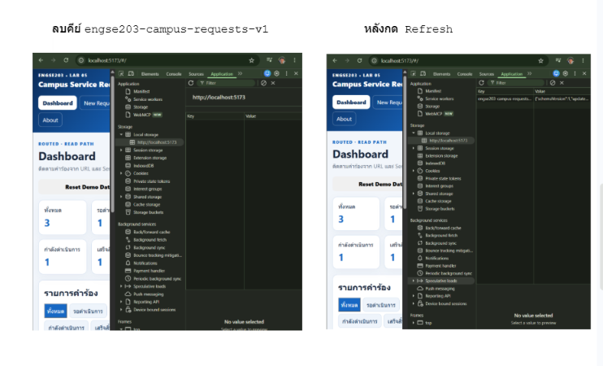|Pass|`images/test-envelope.png`|
| **TC-L5-13** | ส่งฟอร์มโดยเว้นบางช่อง แล้วลองใส่รายละเอียดสั้นกว่า 10 ตัวอักษร | ข้อความเตือนใต้ช่องที่ผิด · **ไม่ใช่ `TypeError` หรือข้อความภาษาโปรแกรมเมอร์** |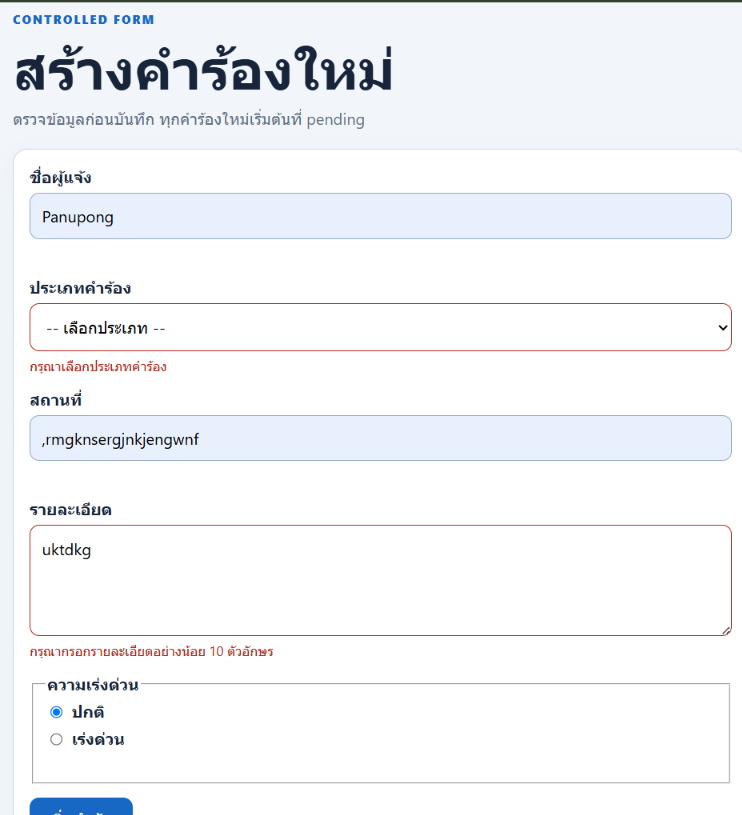|Pass|`images/test-form.png`|
| **TC-L5-14** | เพิ่มคำร้องที่กรอกครบ → เด้งไปหน้ารายละเอียด → กด `F5` | บันทึกสำเร็จ · **หน้ารายละเอียดแสดงข้อมูลจริง** · refresh แล้วคำร้องยังอยู่ |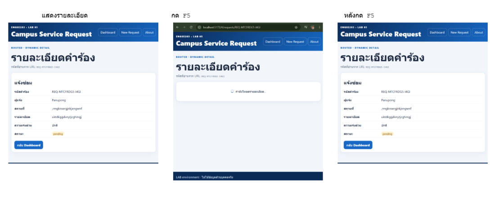|Pass| `images/persistence-add-refresh.png` |
| **TC-L5-16** | ลบคำร้องที่เพิ่งเพิ่ม → กด `F5` | หายจากรายการทันที และ **refresh แล้วไม่กลับมา** |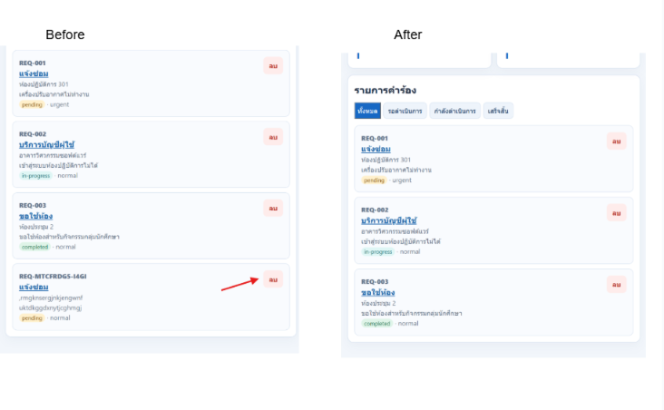|Pass| `images/persistence-delete-refresh.png` |
| **TC-L5-17** | กดปุ่ม Reset Demo Data → ยืนยัน | ข้อมูลตัวอย่างกลับมาครบ · ตัวกรองรีเซ็ตเป็น all · **ข้อมูลของเว็บอื่นในโดเมนเดียวกันไม่ถูกลบ** |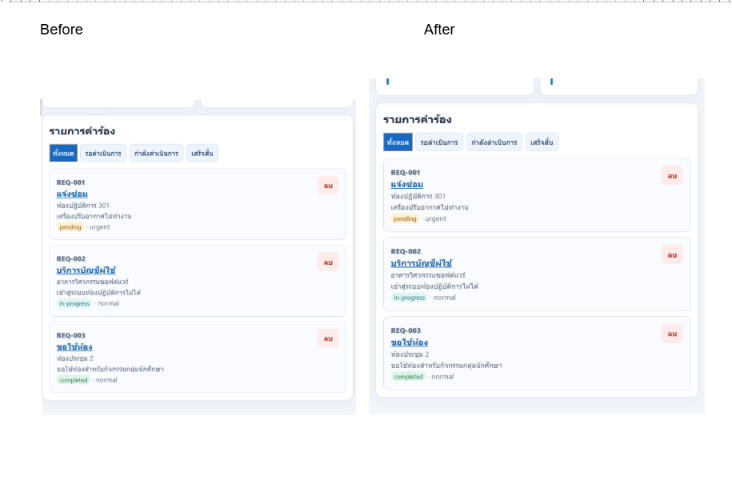|Pass|`images/test-reset.png`|

---

## คาบ 5B · CP04b — Recovery

| ID | ทำอะไร | ผลที่ควรได้ | ผลจริง | สถานะ | หลักฐาน |
|---|---|---|---|---|---|
| **TC-L5-18a** | ใน Local Storage วางค่า `{ ไม่ใช่ JSON` ทับคีย์ LAB05 → refresh | กู้ข้อมูลตัวอย่าง + **ข้อความแจ้งผู้ใช้** · ไม่มีหน้าจอขาว ไม่มี error ค้างใน Console |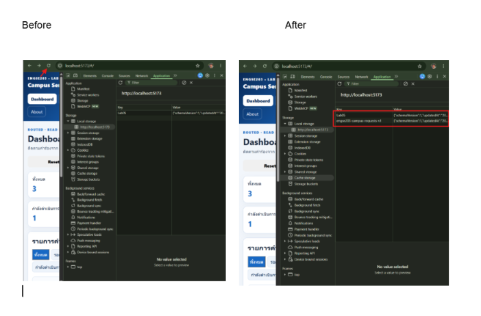|Pass| `images/storage-recovery.png` |
| **TC-L5-18b** | วางค่า `{"schemaVersion":99,"requests":[]}` → refresh | กู้ได้เหมือนกัน · **จับด้วยการเทียบ SCHEMA_VERSION ไม่ใช่ try/catch** |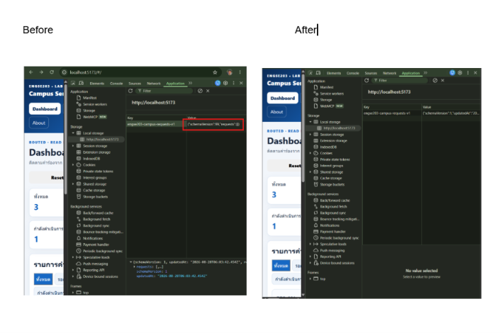|Pass|`images/storage-recovery-value.png`|
| **TC-L5-18c** | วาง envelope ที่มีคำร้อง `id` ซ้ำกัน 2 รายการ → refresh | กู้ได้เหมือนกัน · จับด้วย `validateRequests()` |กู้ข้อมูลกลับ และแสดงแจ้งเตือน "รูปแบบข้อมูลคำร้องไม่ถูกต้อง หรือมี ID ซ้ำ"|Pass| |

---

## คาบ 5B · CP05b — Regression จาก Week 04

> ใช้ regression checklist 11 ข้อประกอบ · แนะนำให้จับคู่ทดสอบไขว้

| ID | ทำอะไร | ผลที่ควรได้ | ผลจริง | สถานะ | หลักฐาน |
|---|---|---|---|---|---|
| **TC-L5-19** | เพิ่มและลบคำร้องหลายรอบ แล้วเทียบตัวเลขในแผงสรุปกับจำนวนรายการที่นับด้วยตา | **ตัวเลขตรงกันทุกครั้ง** ทั้ง total, pending, in-progress, completed |เมื่อกดยืนยันการเปลี่ยนแปลง state อัปเดตพร้อมกัน ทำให้แผงสรุปตรงกับของจริงทุกรอบการกระทำ|Pass|อ้างอิงจาก Regression Checklist|

*(TC-L5-13, 15, 16 รันซ้ำในช่วงนี้ด้วย — บันทึกไว้ในตารางของ CP04a ได้เลย ถ้าผลต่างจากเดิมให้เขียนกำกับ)*

---

## คาบ 5B · CP06 — Verify และ Delivery

| ID | ทำอะไร | ผลที่ควรได้ | ผลจริง | สถานะ | หลักฐาน |
|---|---|---|---|---|---|
| **TC-L5-20** | DevTools → Toggle device toolbar → ตั้งความกว้าง 375px → เปิดครบทุกหน้า | ไม่มีการเลื่อนแนวนอน · ปุ่มกดได้ไม่ทับกัน · ข้อความไม่ถูกตัด |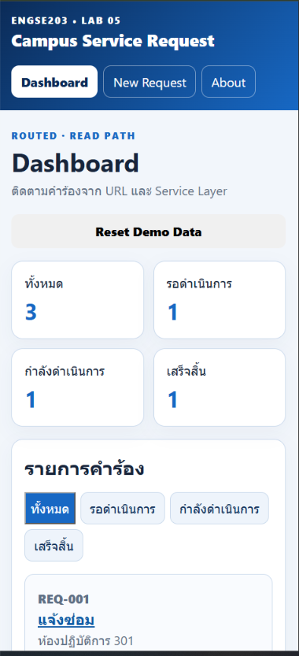|Pass| `images/responsive-375.png` |
| **TC-L5-21** | วางเมาส์ไว้ข้าง ๆ ใช้ `Tab` `Shift+Tab` `Enter` `Space` เท่านั้น | เข้าถึงทุกลิงก์ ปุ่ม และช่องกรอกได้ · **เห็นชัดตลอดว่าโฟกัสอยู่ที่ไหน** |สามารถโฟกัสกรอบนอกได้ด้วย CSS outline ที่ตั้งค่าไว้|Pass| |
| **TC-L5-12** | `npm run check` | ผ่าน **133/133** |สคริปต์ตรวจผ่านหมด (รวมถึงข้อ 3 จุดที่เคย Error ก่อนแก้)|Pass| 133/133|
| **TC-L5-22** | `npm run build` แล้ว `npm run preview` | build ไม่มี error · เปิด preview แล้ว refresh ที่ทุก URL ได้ |ไม่มีข้อผิดพลาดตอนบิลด์และเรียกใช้งาน production ซ้ำได้|Pass| |
| **TC-L5-23** | เปิด GitHub Pages **ในหน้าต่างส่วนตัว** แล้ว refresh ที่ URL ที่มี `#` | โหลดได้ทุกหน้า · refresh แล้วไม่ 404 · ข้อมูลตัวอย่างขึ้นเหมือนผู้ใช้ใหม่ | | | `images/pages-incognito.png` |
| **TC-L5-24** | เปิด Pull Request และติด tag `lab-05-submission-v1` | PR เปิดแล้ว · tag ถูก push ขึ้น remote | | | URL ของ PR |

---

## สรุปผล

| | จำนวน |
|---|---|
| PASS | |
| FAIL | |
| NOT RUN | |
| **รวม** | **24** |

**รายการที่ไม่ผ่าน และสิ่งที่ทำเพื่อแก้**

_____________________________________________

_____________________________________________

_____________________________________________

**สิ่งที่ยังแก้ไม่ได้ และเหตุผล** *(เขียนตามจริง — การยอมรับว่ายังไม่เสร็จดีกว่าการเขียนว่าเสร็จ)*

_____________________________________________

_____________________________________________

---

## ภาคผนวก · ค่าสำหรับทดสอบ TC-L5-18c

คัดลอกไปวางใน Local Storage เพื่อจำลองข้อมูลที่มี `id` ซ้ำ

```json
{"schemaVersion":1,"updatedAt":"2026-08-13T00:00:00.000Z","requests":[
{"id":"REQ-001","requesterName":"ทดสอบ หนึ่ง","requestType":"แจ้งซ่อม","location":"A","details":"รายละเอียดยาวพอสมควร","priority":"normal","status":"pending"},
{"id":"REQ-001","requesterName":"ทดสอบ สอง","requestType":"แจ้งซ่อม","location":"B","details":"รายละเอียดยาวพอสมควร","priority":"normal","status":"pending"}]}
```

---

## ภาคผนวก · ภาพหน้าจอที่ต้องมีครบ 10 ภาพ

เก็บไว้ใน `labs/week-05/evidence/images/`

| # | ชื่อไฟล์ | จาก | คาบ |
|---|---|---|---|
| 1 | `route-not-found.png` | TC-L5-06 | 5A |
| 2 | `state-loading.png` | TC-L5-08 | 5A |
| 3 | `state-error-retry.png` | TC-L5-09 | 5A |
| 4 | `state-empty.png` | TC-L5-11 | 5A |
| 5 | `route-detail-found.png` | TC-L5-04 | 5A |
| 6 | `persistence-add-refresh.png` | TC-L5-14 | 5B |
| 7 | `persistence-delete-refresh.png` | TC-L5-16 | 5B |
| 8 | `storage-recovery.png` | TC-L5-18a | 5B |
| 9 | `responsive-375.png` | TC-L5-20 | 5B |
| 10 | `pages-incognito.png` | TC-L5-23 | หลังคาบ |

> **ก่อนถ่ายทุกครั้ง** ตรวจว่าไม่มีข้อมูลส่วนบุคคลจริงหรือชื่อบัญชีอื่นติดมาในภาพ · ถ้ามีให้ crop หรือปิดทับก่อน
