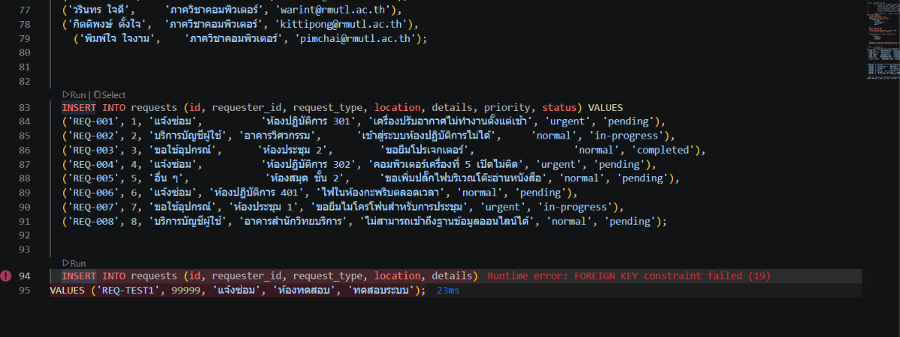
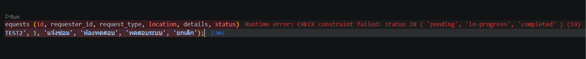
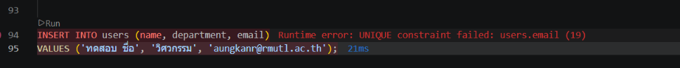
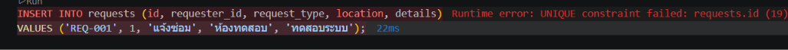
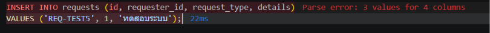
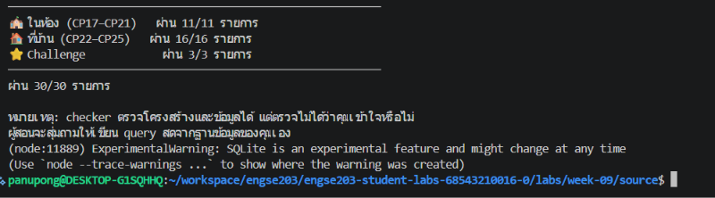

# DB_EVIDENCE — Campus Service Request Database

สรุปการทดสอบและผลการดำเนินงานการสร้างฐานข้อมูล (Database Schema) และสคริปต์ SQL ตาม TODO W09 (CP22–CP25)

---

## 1. ข้อมูลทั่วไป

| หัวข้อ | รายละเอียด |
|---|---|
| ไฟล์หลักที่ใช้ | `schema.sql`, `queries.sql`, `DATA_MODEL.md` |
| เครื่องมือที่ใช้ | `sqlite3`, สคริปต์ตรวจแล็บ `check-week09.mjs` |
| จำนวนเคสทดสอบ (Constraint) | 5 เคส |
| คำสั่งรันทดสอบ | `node check-week09.mjs` |
| ผู้จัดทำ | ภานุพงษ์ ทองดี 68543210016-0 |
| วันที่ทดสอบ | 26/09/2026 |

---

## 2. รายการเคสทดสอบ (Constraint Tests - CP25)

| # | เคสทดสอบ | ข้อมูลที่ป้อน / คำสั่ง | ผลลัพธ์ที่คาดหวัง |
|---|---|---|---|
| 1 | ทดสอบ Foreign Key | `requester_id = 99999` (ผู้ใช้ไม่มีจริง) | `FOREIGN KEY constraint failed` |
| 2 | ทดสอบ CHECK | `status = 'ยกเลิก'` (ไม่อยู่ในเงื่อนไข) | `CHECK constraint failed` |
| 3 | ทดสอบ UNIQUE (Email) | ใส่อีเมลซ้ำกับคนที่มีอยู่ (`aungkanr@...`) | `UNIQUE constraint failed: users.email` |
| 4 | ทดสอบ PK / UNIQUE | ใส่คำร้องที่ `id = 'REQ-001'` (ซ้ำ) | `UNIQUE constraint failed: requests.id` |
| 5 | ทดสอบ NOT NULL | บันทึกคำร้องโดยไม่ระบุ `location` | `NOT NULL constraint failed: requests.location` |

---

## 3. วิธีรันชุดทดสอบและการจำลองข้อมูล

1. รันไฟล์ `schema.sql` เพื่อลบตารางเดิม สร้างตารางใหม่ และใส่ข้อมูล Seed Data
2. รันสคริปต์ของรายวิชาเพื่อตรวจสอบความถูกต้องทั้งหมด:

```bash
node check-week09.mjs
```

---

## 4. ผลการรันทดสอบ

สรุปผลการทดสอบ Constraints และสคริปต์ตรวจแล็บ

| # | เคส / หัวข้อ | ผลลัพธ์ |
|---|---|---|
| 1 | Foreign Key Error | ✅ |
| 2 | CHECK Error | ✅ |
| 3 | UNIQUE (Email) Error | ✅ |
| 4 | PK (ID) Error | ✅ |
| 5 | NOT NULL Error | ✅ |
| 6 | เช็คสคริปต์ `node check-week09.mjs` | ✅ |

**จำนวนรายการเช็คลิสต์ที่ผ่าน:** 30 / 30 (ผ่านครบทั้ง CP17–CP25 และ Challenge)

### รายละเอียดแต่ละเคส

**1. Foreign Key Error**

```sql
INSERT INTO requests (id, requester_id, request_type, location, details)
VALUES ('REQ-TEST1', 99999, 'แจ้งซ่อม', 'ห้องทดสอบ', 'ทดสอบระบบ');
```



**2. CHECK Error**

```sql
INSERT INTO requests (id, requester_id, request_type, location, details, status)
VALUES ('REQ-TEST2', 1, 'แจ้งซ่อม', 'ห้องทดสอบ', 'ทดสอบระบบ', 'ยกเลิก');
```



**3. UNIQUE (Email) Error**

```sql
INSERT INTO users (name, department, email)
VALUES ('ทดสอบ ชื่อ', 'วิศวกรรม', 'aungkanr@rmutl.ac.th');
```



**4. PK (ID) Error**

```sql
INSERT INTO requests (id, requester_id, request_type, location, details)
VALUES ('REQ-001', 1, 'แจ้งซ่อม', 'ห้องทดสอบ', 'ทดสอบระบบ');
```



**5. NOT NULL Error**

```sql
INSERT INTO requests (id, requester_id, request_type, details)
VALUES ('REQ-TEST5', 1, 'ทดสอบระบบ');
```



**6. เช็คสคริปต์ node check-week09.mjs**

```bash
node check-week09.mjs
```



---

## 5. หมายเหตุ

- ในการทดสอบข้อที่ 1 (Foreign Key) ต้องมั่นใจว่ารันคำสั่ง `PRAGMA foreign_keys = ON;` ใน Session เดียวกันเสมอ มิฉะนั้นระบบ (SQLite) จะอนุญาตให้บันทึกข้อมูลผิดพลาดโดยไม่มี Error ฟ้อง
- หากต้องการรันเพื่อตรวจสอบ Constraints ทั้งหมดใหม่ ต้องลบข้อมูลที่ Error ออกก่อน เพื่อให้ชุดข้อมูลคงความถูกต้อง (Data Integrity) ตามโครงสร้าง `schema.sql`