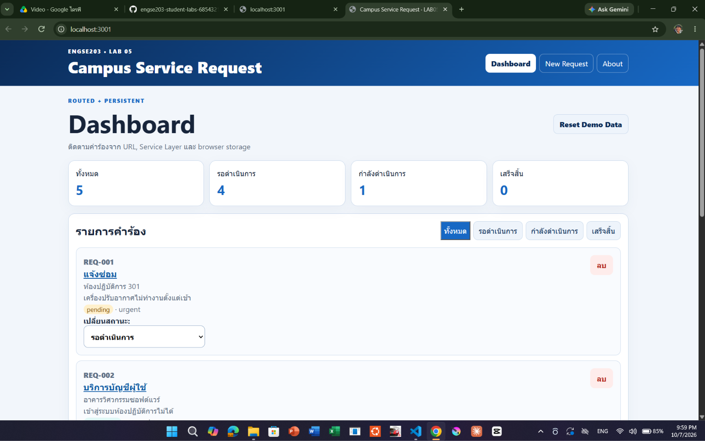
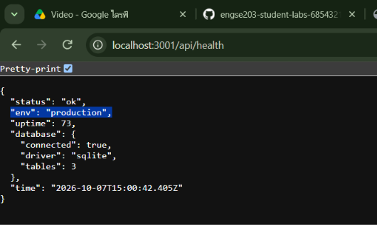

## หลักฐานที่ 1: Production แบบพอร์ตเดียว (One Port) แสดงให้เห็นหน้าเว็บ React และ API ทำงานผ่านพอร์ต 3001 เพียงพอร์ตเดียว

## หลักฐานที่ 2:** ผลลัพธ์ `/api/health` ที่แสดงสถานะ Production และหน้าต่าง Terminal
แสดงค่า `"env": "production"` และ Terminal ที่แสดงการรันระบบ
