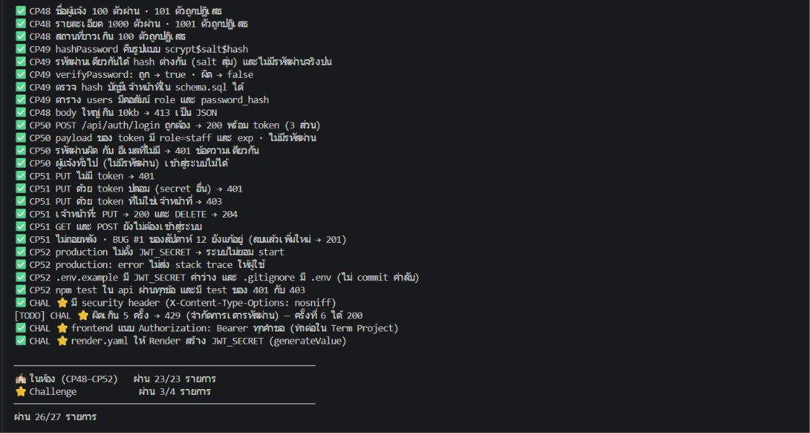
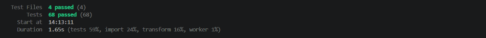
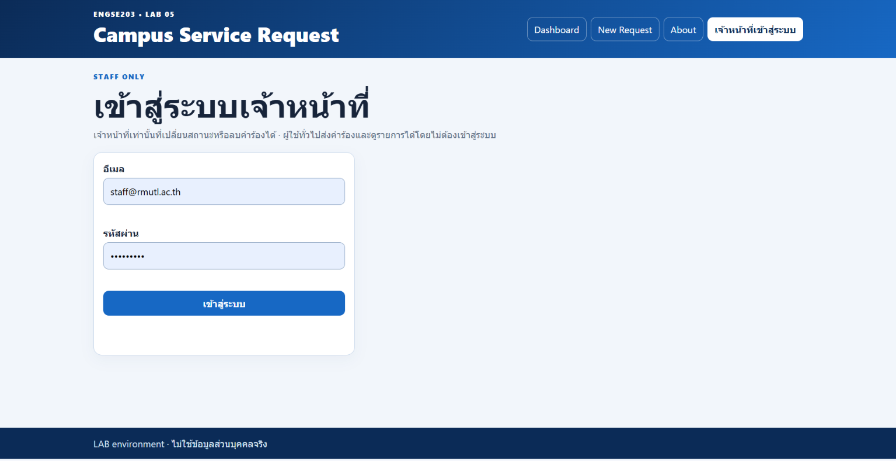
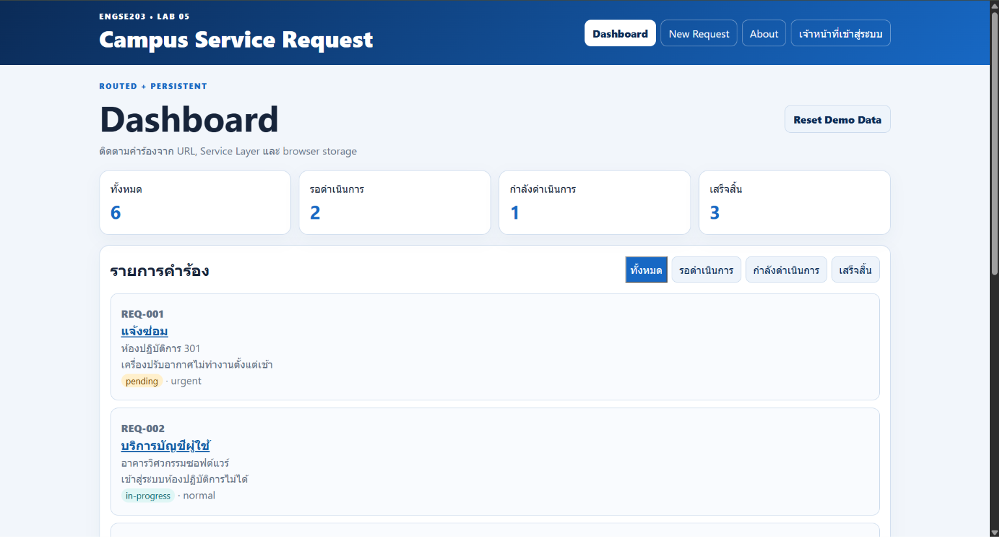
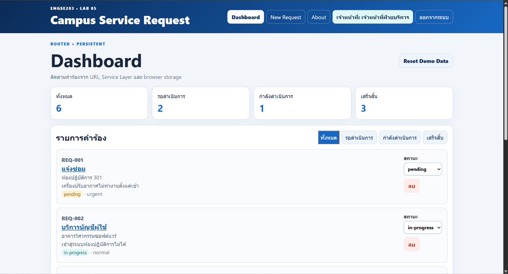

# LAB 13 — Evidence: ความปลอดภัยของ API (Validation · Hashing · Login · สิทธิ์ · Secret)

| รายการ | ข้อมูล |
|---|---|
| รายวิชา | ENGSE203 |
| รหัสนักศึกษา | 68543210016 |
| GitHub | PanupongThongdee |
| Repository | `engse203-student-labs-68543210016-0` (branch `lab/week-13`) |
| โฟลเดอร์งาน | `labs/week-13/source` |
| วันที่ตรวจ | 10 ตุลาคม 2569 |

## 1. สรุปผล

| ส่วน | ผ่าน | หมายเหตุ |
|---|---|---|
| ในห้อง (CP48–CP52) | **23 / 23** | ผ่านครบ |
| Challenge ⭐ | **3 / 4** | ยังไม่ทำข้อจำกัดการเดารหัสผ่าน (429) |
| **รวม** | **26 / 27** | |

## 2. วิธีรันตัวตรวจ

รันที่ `labs/week-13/source` โดยเปิด API ทิ้งไว้ใน terminal อื่น

```bash
node --disable-warning=ExperimentalWarning check-week13.mjs
```

## 3. ผลลัพธ์จาก Terminal (ข้อความต้นฉบับ)

### 3.1 สรุปผลการตรวจ

```text
✅ CP48 ชื่อผู้แจ้ง 100 ตัวผ่าน · 101 ตัวถูกปฏิเสธ
✅ CP48 รายละเอียด 1000 ตัวผ่าน · 1001 ตัวถูกปฏิเสธ
✅ CP48 สถานที่ยาวเกิน 100 ตัวถูกปฏิเสธ
✅ CP49 hashPassword คืนรูปแบบ scrypt$salt$hash
✅ CP49 รหัสผ่านเดียวกันได้ hash ต่างกัน (salt สุ่ม) และไม่มีรหัสผ่านจริงปน
✅ CP49 verifyPassword: ถูก → true · ผิด → false
✅ CP49 ตรวจ hash บัญชีเจ้าหน้าที่ใน schema.sql ได้
✅ CP49 ตาราง users มีคอลัมน์ role และ password_hash
✅ CP48 body ใหญ่เกิน 10kb → 413 เป็น JSON
✅ CP50 POST /api/auth/login ถูกต้อง → 200 พร้อม token (3 ส่วน)
✅ CP50 payload ของ token มี role=staff และ exp · ไม่มีรหัสผ่าน
✅ CP50 รหัสผ่านผิด กับ อีเมลที่ไม่มี → 401 ข้อความเดียวกัน
✅ CP50 ผู้แจ้งทั่วไป (ไม่มีรหัสผ่าน) เข้าสู่ระบบไม่ได้
✅ CP51 PUT ไม่มี token → 401
✅ CP51 PUT ด้วย token ปลอม (secret อื่น) → 401
✅ CP51 PUT ด้วย token ที่ไม่ใช่เจ้าหน้าที่ → 403
✅ CP51 เจ้าหน้าที่: PUT → 200 และ DELETE → 204
✅ CP51 GET และ POST ยังไม่ต้องเข้าสู่ระบบ
✅ CP51 ไม่ถอยหลัง · BUG #1 ของสัปดาห์ 12 ยังแก้อยู่ (ลบแล้วเพิ่มใหม่ → 201)
✅ CP52 production ไม่ตั้ง JWT_SECRET → ระบบไม่ยอม start
✅ CP52 production: error ไม่ส่ง stack trace ให้ผู้ใช้
✅ CP52 .env.example มี JWT_SECRET ค่าว่าง และ .gitignore มี .env (ไม่ commit ค่าลับ)
✅ CP52 npm test ใน api ผ่านทุกข้อ และมี test ของ 401 กับ 403
✅ CHAL ⭐ มี security header (X-Content-Type-Options: nosniff)
[TODO] CHAL ⭐ ผิดเกิน 5 ครั้ง → 429 (จำกัดการเดารหัสผ่าน) — ครั้งที่ 6 ได้ 200
✅ CHAL ⭐ frontend แนบ Authorization: Bearer ทุกคำขอ (ทำต่อใน Term Project)
✅ CHAL ⭐ render.yaml ให้ Render สร้าง JWT_SECRET (generateValue)

──────────────────────────────────────────────────────────
🏫 ในห้อง (CP48–CP52)   ผ่าน 23/23 รายการ
⭐ Challenge            ผ่าน 3/4 รายการ
──────────────────────────────────────────────────────────
ผ่าน 26/27 รายการ
```


## 4. อธิบายหลักฐานแต่ละ Checkpoint

### CP48 — Validation และจำกัดขนาด

| ตรวจอะไร | ผลที่ได้ | หลักฐานใน log |
|---|---|---|
| ชื่อผู้แจ้ง 100 ตัวผ่าน · 101 ตัวถูกปฏิเสธ | ✅ | |
| รายละเอียด 1000 ตัวผ่าน · 1001 ตัวถูกปฏิเสธ | ✅ | |
| สถานที่ยาวเกิน 100 ตัวถูกปฏิเสธ | ✅ | |
| body เกิน 10kb → 413 เป็น JSON | ✅ | `POST /api/requests 413` |

เหตุผล: จำกัดขนาดข้อมูลเข้าเพื่อกันการส่งข้อมูลก้อนใหญ่มาถล่มเซิร์ฟเวอร์ และกันข้อมูลที่ไม่สมเหตุสมผลเข้าฐานข้อมูล

### CP49 — เก็บรหัสผ่านด้วย Hash

| ตรวจอะไร | ผลที่ได้ |
|---|---|
| `hashPassword` คืนรูปแบบ `scrypt$salt$hash` | ✅ |
| รหัสผ่านเดียวกันได้ hash ต่างกัน (salt สุ่ม) และไม่มีรหัสผ่านจริงปน | ✅ |
| `verifyPassword`: ถูก → true · ผิด → false | ✅ |
| ตรวจ hash ของบัญชีเจ้าหน้าที่ใน `schema.sql` ได้ | ✅ |
| ตาราง `users` มีคอลัมน์ `role` และ `password_hash` | ✅ |

เหตุผล: ฐานข้อมูลไม่เก็บรหัสผ่านจริง เก็บเฉพาะ hash พร้อม salt สุ่ม ต่อให้ข้อมูลรั่วก็ย้อนกลับเป็นรหัสผ่านไม่ได้โดยตรง

### CP50 — เข้าสู่ระบบด้วย Token (JWT)

| ตรวจอะไร | ผลที่ได้ | หลักฐานใน log |
|---|---|---|
| อีเมลและรหัสผ่านถูก → 200 พร้อม token 3 ส่วน | ✅ | `POST /api/auth/login 200` |
| payload มี `role=staff` และ `exp` ไม่มีรหัสผ่านปน | ✅ | |
| รหัสผ่านผิด กับ อีเมลที่ไม่มี → 401 ข้อความเดียวกัน | ✅ | `POST /api/auth/login 401` (ขนาด response 93 ไบต์ เท่ากัน) |
| ผู้แจ้งทั่วไป (ไม่มีรหัสผ่าน) เข้าสู่ระบบไม่ได้ | ✅ | `POST /api/auth/login 401` |

เหตุผล: ข้อความ error เหมือนกันทั้งกรณีรหัสผ่านผิดและอีเมลไม่มีอยู่ เพื่อไม่ให้ผู้โจมตีรู้ว่าอีเมลใดมีอยู่ในระบบ

### CP51 — จำกัดสิทธิ์ (Authentication และ Authorization)

| สถานการณ์ | ผลที่คาดหวัง | ผลที่ได้ | หลักฐานใน log |
|---|---|---|---|
| PUT ไม่มี token | 401 | ✅ | `PUT /api/requests/REQ-001 401` |
| PUT ด้วย token ปลอม (secret อื่น) | 401 | ✅ | `PUT /api/requests/REQ-001 401` |
| PUT ด้วย token ที่ไม่ใช่เจ้าหน้าที่ | 403 | ✅ | `PUT /api/requests/REQ-001 403` |
| เจ้าหน้าที่ PUT | 200 | ✅ | `PUT /api/requests/REQ-001 200` |
| เจ้าหน้าที่ DELETE | 204 | ✅ | `DELETE /api/requests/REQ-003 204` |
| GET และ POST ไม่ต้องเข้าสู่ระบบ | 200 / 201 | ✅ | `GET /api/requests 200` · `POST /api/requests 201` |
| ไม่ถอยหลัง: ลบแล้วเพิ่มใหม่ → 201 (BUG #1 สัปดาห์ 12) | 201 | ✅ | `DELETE REQ-002 204` แล้ว `POST /api/requests 201` |

ความต่างของรหัสสถานะ: **401** คือ "ไม่รู้ว่าคุณเป็นใคร" (ไม่มี token หรือ token ปลอม) ส่วน **403** คือ "รู้ว่าคุณเป็นใคร แต่ไม่มีสิทธิ์ทำรายการนี้"

### CP52 — Secret และการตั้งค่า Production

| ตรวจอะไร | ผลที่ได้ |
|---|---|
| production ไม่ตั้ง `JWT_SECRET` → ระบบไม่ยอม start (fail fast) | ✅ |
| production: error ไม่ส่ง stack trace ให้ผู้ใช้ | ✅ |
| `.env.example` มี `JWT_SECRET` ค่าว่าง และ `.gitignore` มี `.env` | ✅ |
| `npm test` ใน `api` ผ่านทุกข้อ และมี test ของ 401 กับ 403 | ✅ |

## 5. Challenge ⭐

| ข้อ | สถานะ | รายละเอียด |
|---|---|---|
| Security header `X-Content-Type-Options: nosniff` | ✅ ผ่าน | เพิ่ม middleware ใน `api/src/app.js` ให้ทุก response |
| `render.yaml` สร้าง `JWT_SECRET` เอง (`generateValue`) | ✅ ผ่าน | secret ไม่ถูกเก็บใน GitHub |
| Frontend แนบ `Authorization: Bearer` ทุกคำขอ | ✅ ผ่าน | แนบใน `frontend/src/services/apiClient.js` เมื่อเข้าสู่ระบบอยู่ |
| ผิดเกิน 5 ครั้ง → 429 (จำกัดการเดารหัสผ่าน) | ⬜ ยังไม่ได้ทำ | ตัวตรวจแจ้งว่าครั้งที่ 6 ยังได้ 200 |

### ข้อที่ยังไม่ผ่าน: จำกัดการเดารหัสผ่าน (429)

ใน log ช่วงท้ายมีการล็อกอินผิดต่อเนื่อง 5 ครั้ง (401) แล้วครั้งที่ 6 ได้ `200` แปลว่ายังไม่มีตัวจำกัดจำนวนครั้ง

แนวทางที่จะทำต่อ: เพิ่ม middleware ที่ route `POST /api/auth/login` นับจำนวนครั้งที่ล็อกอินล้มเหลวต่อ IP ในช่วงเวลาหนึ่ง เมื่อเกิน 5 ครั้งให้ตอบ `429 Too Many Requests` และล้างตัวนับเมื่อล็อกอินสำเร็จ

## 6. งานเพิ่มเติม: หน้าล็อกอินเจ้าหน้าที่ (Frontend)

- เพิ่มหน้า `pages/LoginPage.jsx` และ route `/login` ใน `App.jsx`
- เก็บสถานะการเข้าสู่ระบบด้วย `context/AuthContext.jsx` และเก็บ token ใน `services/authStorage.js`
- ผู้ใช้ทั่วไปส่งคำร้องและดูรายการได้ แต่ไม่เห็นปุ่มลบและเปลี่ยนสถานะ
- เจ้าหน้าที่ที่เข้าสู่ระบบแล้วเห็นปุ่มลบและตัวเลือกสถานะ
- การซ่อนปุ่มเป็นเพียงความสะดวกของผู้ใช้ ความปลอดภัยจริงอยู่ที่ API ซึ่งตรวจ token และ role ทุกครั้ง

## 7. ปัญหาที่พบและวิธีแก้

| ปัญหา | สาเหตุ | วิธีแก้ |
|---|---|---|
| `git pull` ขึ้น hint ว่า branch diverge | commit บนเครื่องกับบน GitHub แยกทางกัน | เลือกวิธีรวมงานเอง (merge หรือ rebase) หรือใช้ `git fetch` ดูก่อน |
| `no such column: role` ตอน login | ฐานข้อมูลเป็น schema เก่า และ `loadSeed()` ข้ามการรัน `schema.sql` เมื่อมีตารางอยู่แล้ว | เพิ่มคอลัมน์ `role` และ `password_hash` ให้ตาราง `users` |
| `EADDRINUSE` พอร์ต 3001 | มี API ตัวเก่ารันค้างอยู่ | หา PID ด้วย `lsof -i :3001` แล้ว `kill` |
| test ใน `requests.api.test.js` ล้ม 6 ข้อ (401) | requirement เปลี่ยน PUT และ DELETE ต้องใช้ token ของเจ้าหน้าที่ | แก้ test ให้ล็อกอินก่อนด้วย `loginAsStaff` แล้วแนบ header |
| CORS ถูกบล็อก | เปิดเว็บด้วย `127.0.0.1:5173` แต่ API อนุญาตเฉพาะ `localhost:5173` | เปิดเว็บที่ `http://localhost:5173` |
| `Invalid hook call` | เรียก `useAuth()` นอกฟังก์ชัน component | ย้าย hook เข้าไปในฟังก์ชัน `AppHeader` |

## 8. ภาพประกอบ (Screenshot)

> แทรกภาพหน้าจอตามหัวข้อด้านล่าง แล้วลบบรรทัดคำอธิบายนี้ออก

1. ผลรัน `check-week13.mjs` ทั้งหมด (26/27)

2. ผลรัน `npm test --prefix api` (ผ่านทุกข้อ)

3. หน้า `/login` ของเจ้าหน้าที่

4. หน้า Dashboard ตอนยังไม่เข้าสู่ระบบ (ไม่มีปุ่มลบ)

5. หน้า Dashboard ตอนเข้าสู่ระบบเป็นเจ้าหน้าที่ (มีปุ่มลบและตัวเลือกสถานะ)



## 9. สรุป

- ระบบมีชั้นป้องกันครบตามเนื้อหาสัปดาห์นี้: จำกัดขนาดข้อมูล, เก็บรหัสผ่านแบบ hash, ออก token ด้วย JWT, แยกสิทธิ์ 401 และ 403, และไม่เก็บ secret ไว้ใน repository
- ตัวตรวจผ่าน 26 จาก 27 รายการ ที่ยังไม่ผ่านคือข้อจำกัดการเดารหัสผ่าน (429) ซึ่งเป็น Challenge ไม่บังคับ